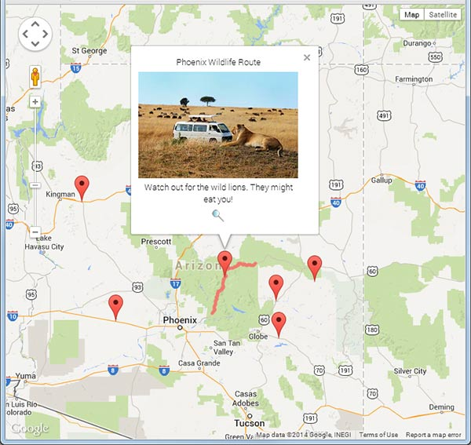
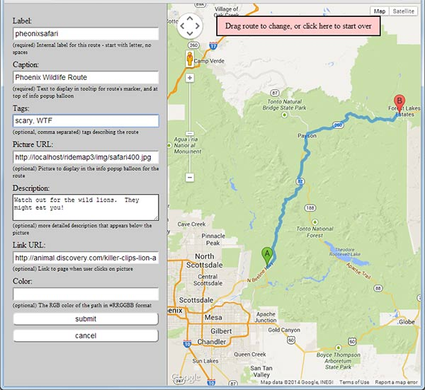
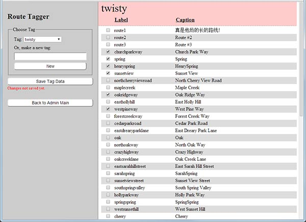

# ridemap

##Summary:

Google Maps version 3 based database of road paths (polylines), with admin interface for editing and tagging paths.
A marker is displayed for each path on a google map, and the full route, with additional information
is shown in a google maps infoWindow when the marker is clicked on.   In the infoWindow is a user specified image
that links to a user specified URL.

##Dependencies:

A server with PHP and MySQL installed.   Sorry not sure which versions are needed, but nothing fancy is
being done, so if it's not older that 2008 vintage you should be fine.

##Sample screen shots:

###A map:

###Administration interface:

###Tagger interface:

Creator: Mark T. Sanford (marktsanford@gmail.com)
Licenced under MIT License.
